+++
date = '2025-08-27T00:00:00Z'
title = 'Automating Youtube Workflows'
+++

Note: _This is generated from a transcript from one of my [YouTube videos](https://www.youtube.com/@BensSmartHomeIdeas)_

---

# Automating YouTube Workflows: My End-to-End Process

Today, I'm excited to share with you how I automate as much as possible to create these YouTube videos from start to finish. This comprehensive guide covers everything from the initial spark of an idea all the way through to publishing the final video, followed by a blog post – which I generally publish for those who prefer to read rather than watch. I've had quite a few people ask me about my workflow, especially the technical bits, so I thought it was about time I shared the whole process. Plus, I'll be sharing some of the scripts and automations that I've built along the way, so you can grab them for free if you want to use them for your own projects.

## Capturing Ideas: From Voice Notes to Obsidian

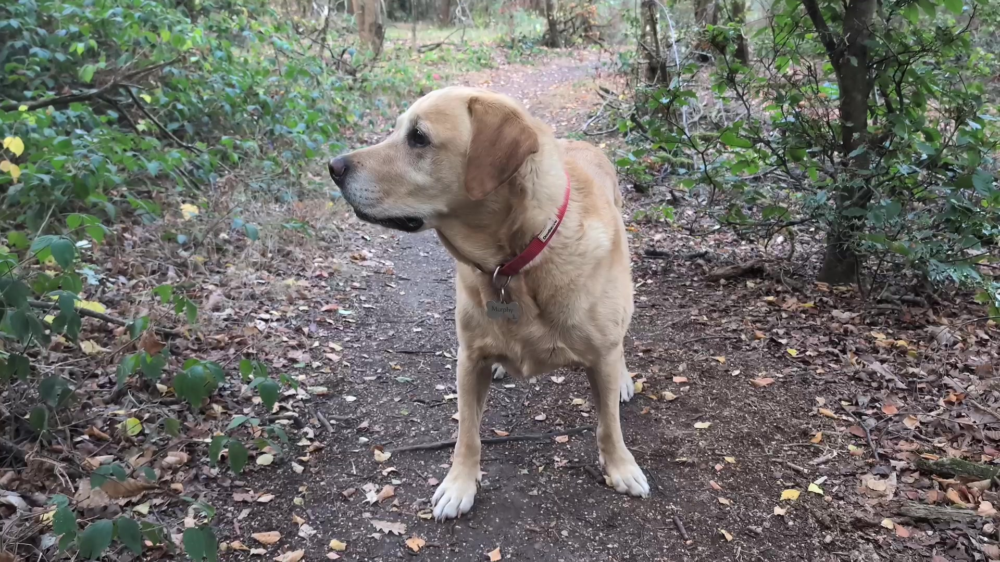
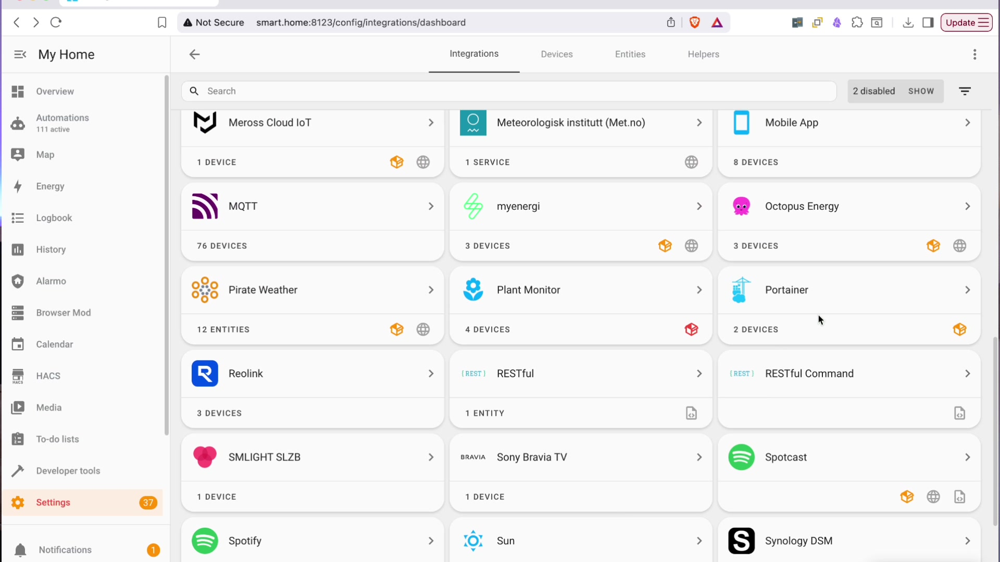
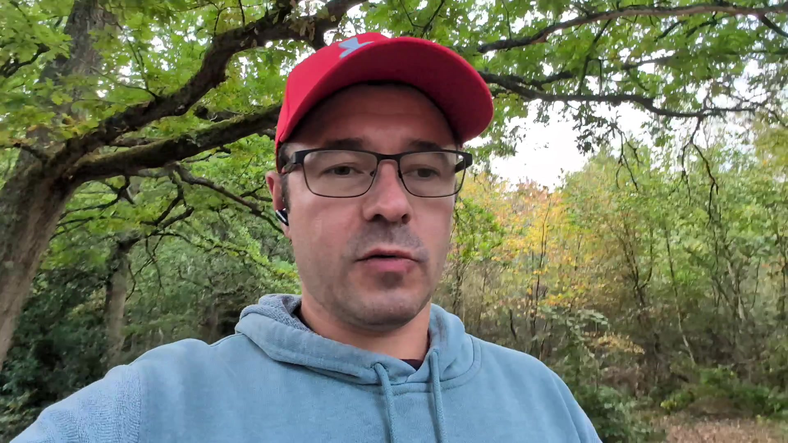
Sometimes, inspiration strikes when I'm just walking the dog. Maybe I've just solved a particularly annoying automation problem, or I've discovered a new integration. When this happens, I'll often just record some quick voice notes onto my phone. Nothing fancy, just me muttering a few notes in a raw format. I don't try to make them perfect, and often they'll contain unexpected phrases like, "Murphy, don't eat that!" because my lab has just tried to eat something questionable off the path. Later on, I'll feed those notes into AI to help me turn them into actionable bullet points and remove the "umms" and "ahs." It's quite satisfying, actually, turning those scattered, raw thoughts from those "something cool" moments into something that might actually be useful content.

Other times, I have specific things I want to share. Maybe I've been dabbling with a new device, or I've just figured out something that I think the community would find generally useful. The key is capturing these ideas when they happen because they have a habit of disappearing otherwise. Once I've got an idea that I think is worth exploring, everything goes into Obsidian. I absolutely love Obsidian for this stuff; it's perfect for organizing thoughts and building out content structures. Sometimes the process happens over a week, and I'll have a note sitting there, and every now and again, I'll just log on and add another bullet point or flesh out some of the sections.

## Streamlining Script Creation with Templates and AI

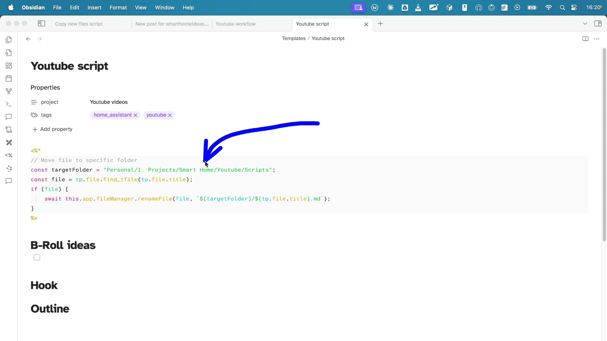
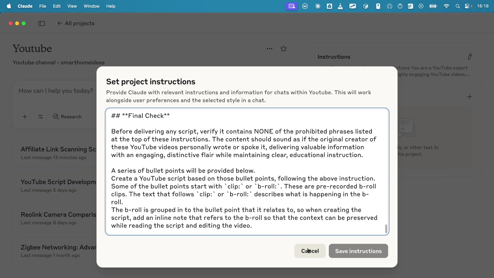
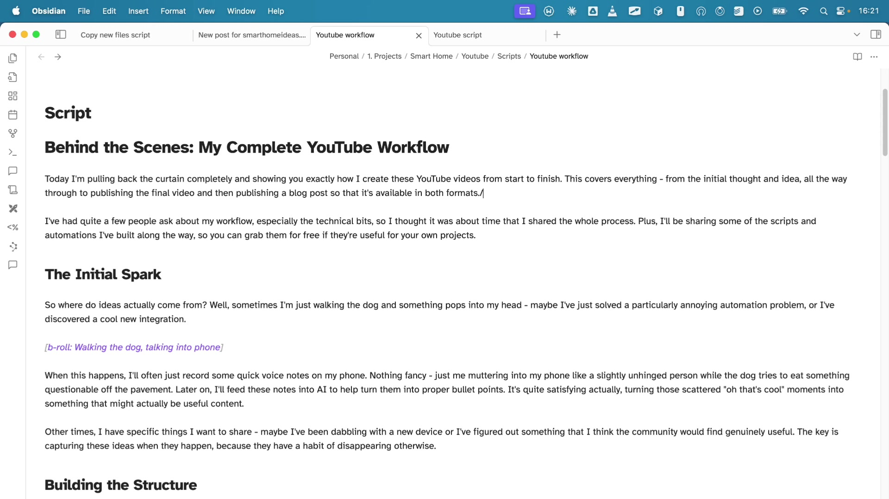
A real game-changer has been setting up a proper YouTube template in Obsidian. I use a template with a custom script that handles all of the tedious setup work. When I want to create a new video script, I just select "New note using template," and it automatically uses the YouTube template and copies the file into the correct location. This might sound like a small thing, but it removes so much friction from the process. I can literally create a new script structure within seconds, which means I'm more likely to actually capture ideas when they strike. You know how it is – the best ideas always seem to happen when you're nowhere near a computer, usually while you're brushing your teeth or trying to remember if you've locked the front door.

Once I've got all of the bullet points properly fleshed out, I feed them into a Claude project, and this is where I gain back even more time. The Claude project has a bunch of prompts that I've trained from previous videos using Notebook LM. Essentially, I've taught it to write in my voice and style, so when I give it bullet points, it can turn them into more structured scripts that actually sound like me rather than generic AI content. I do have to say, though, it's remarkably good at making fairly standard topics particularly cringy. I like dad jokes, but it can really go off the rails sometimes trying to be funny. Obviously, I still need to edit the output; AI isn't perfect, and sometimes it suggests phrases that just don't work or sound a bit strange. The key is using it as a starting point rather than the final product. It's basically good for a first draft, but it can be pretty good at creating the framework for the thoughts and message that you want to communicate.

## Recording: Gear, Automation, and Teleprompter Tricks

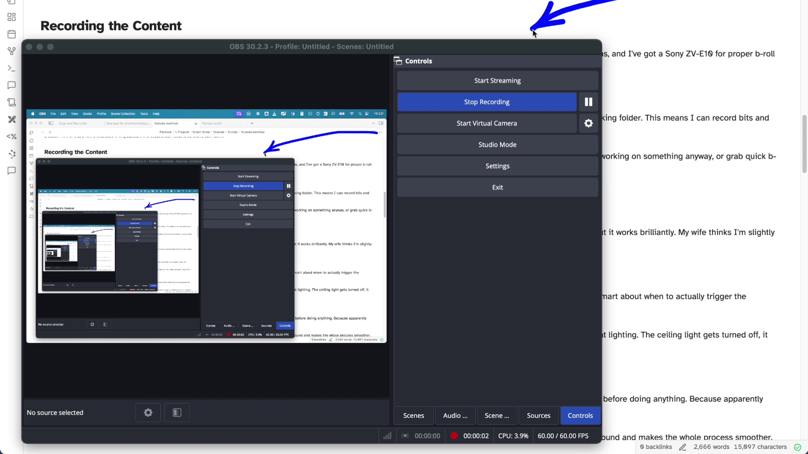

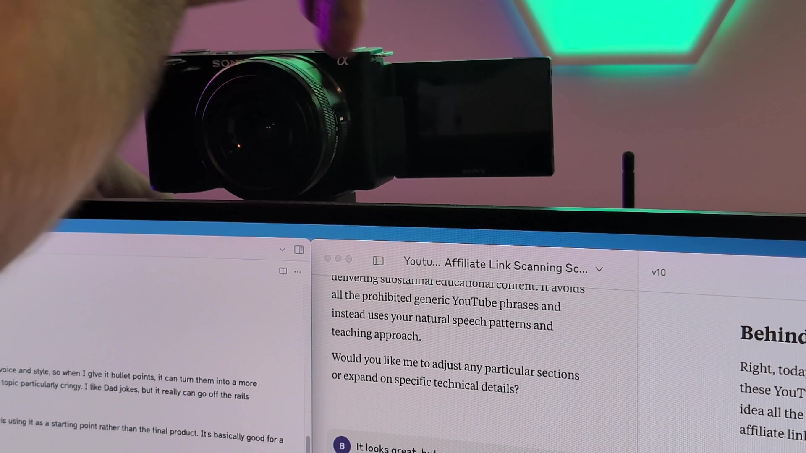
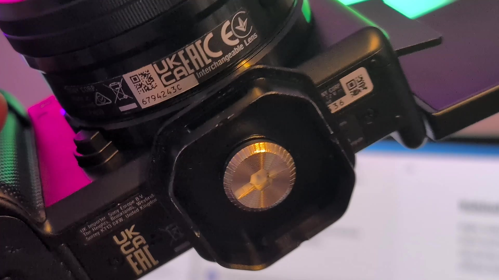
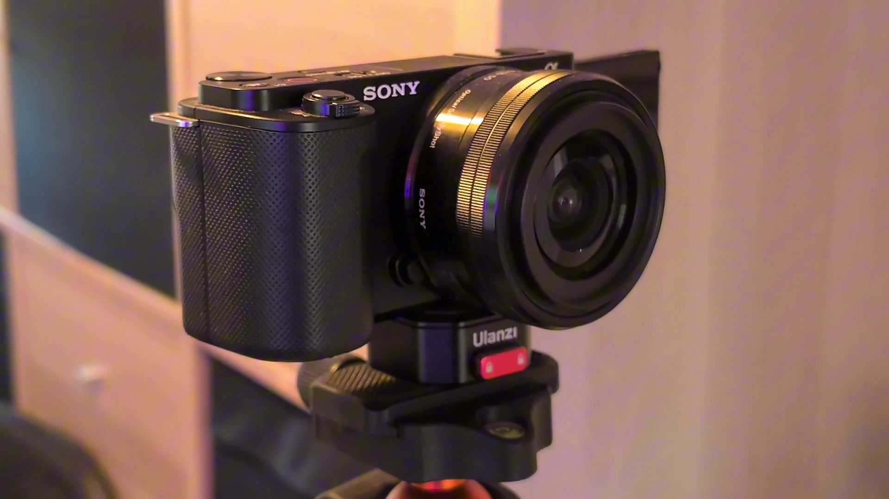

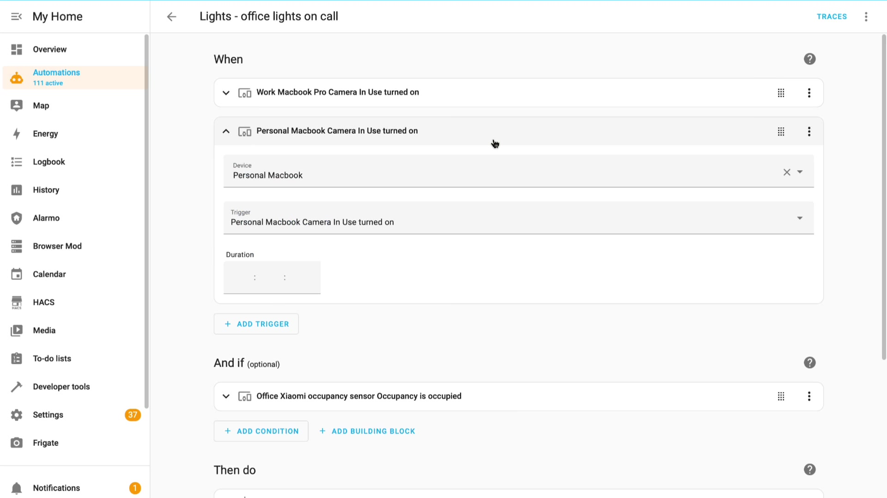
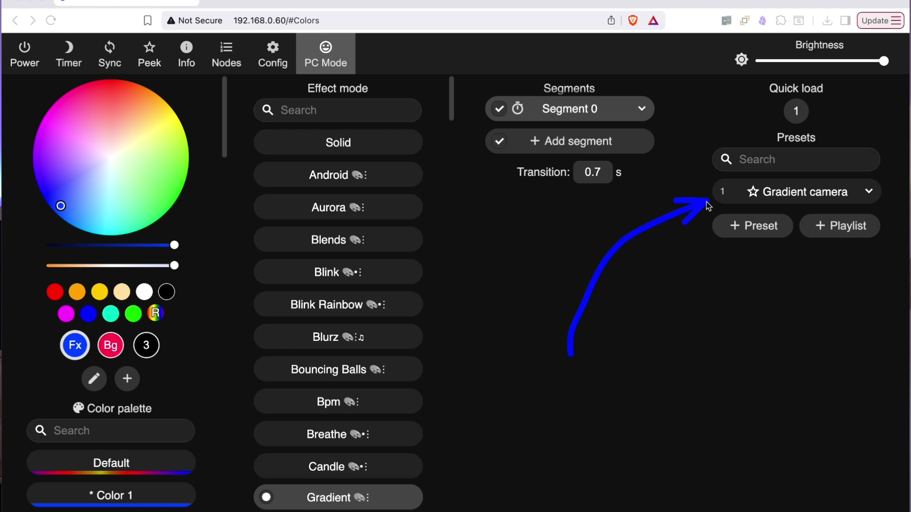

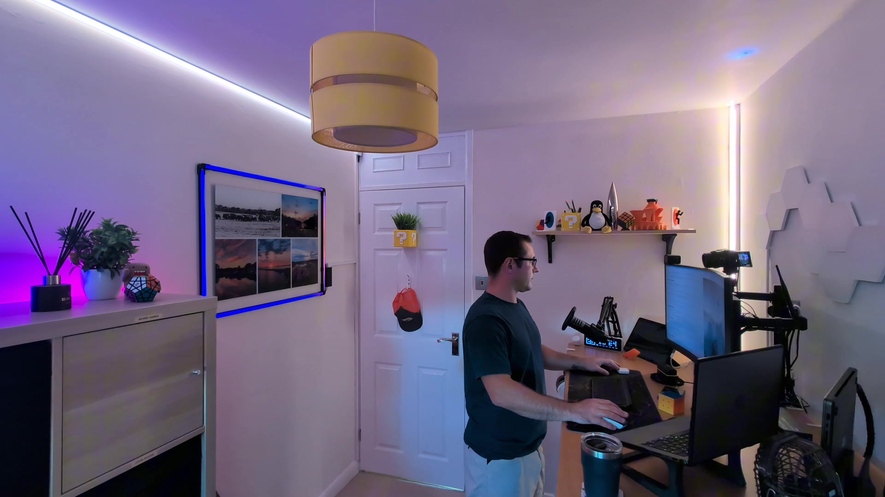
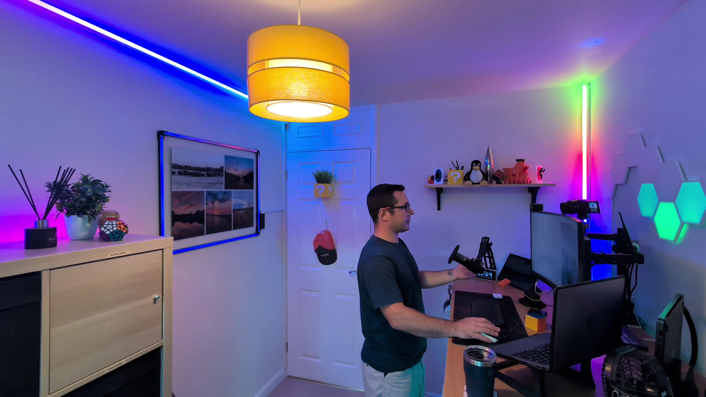
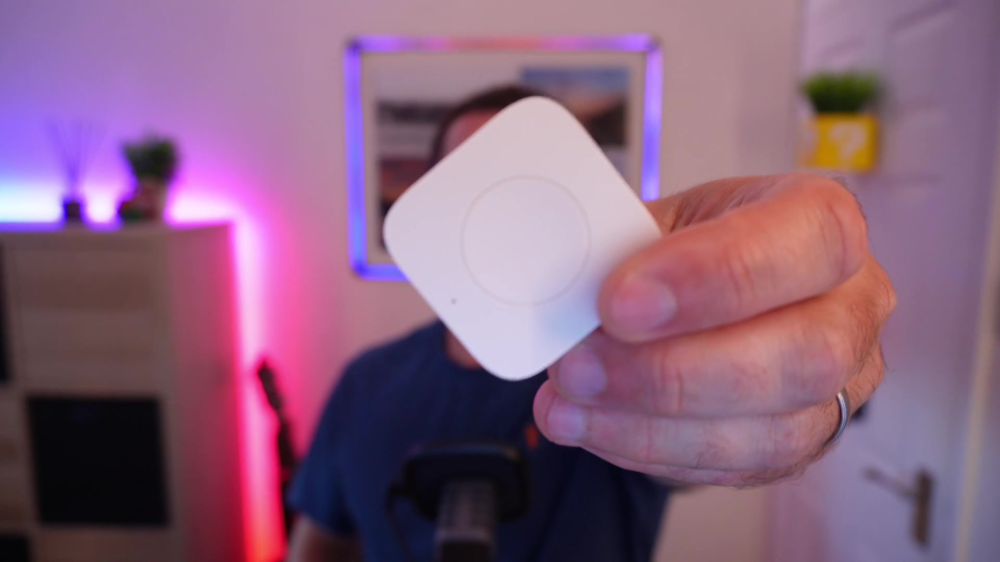

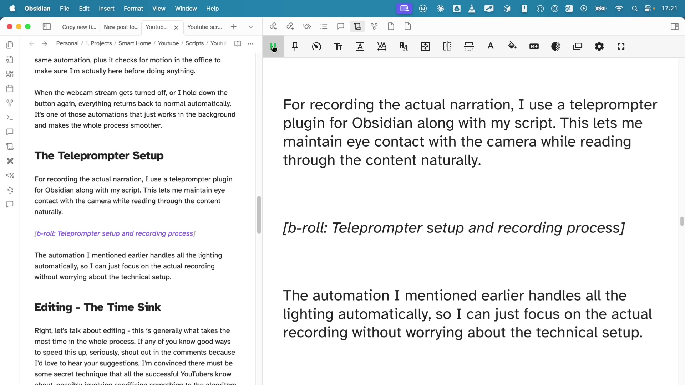
For the actual recording, I've got a setup that works really well for me. I use OBS to capture my entire MacBook screen for any software demonstrations, and I've got a Sony ZV-E10 for proper B-roll footage as well. The tripod I have and the mount for the camera have these little U-Lan-Z clips that make taking the camera off and mounting it on the tripod a snap. I don't have to fiddle with screwing it on each time, which saves me a bunch of time and hassle. One thing that's made a huge difference is a script I wrote that automatically copies anything with a creation date within the last three hours to a working folder. This means I can record bits and pieces when I have small pockets of free time, and then everything gets organized automatically.

Okay, let me dive into one of my favorite automations: the lighting setup that's triggered when I start recording. This is actually the exact same setup I use when I take video calls for work. The automation will be triggered by my work Mac or personal Mac camera turning on. This uses the Home Assistant companion app for the Mac, so the automation is pretty straightforward. When it detects I'm recording, it automatically turns on the light behind my Galaxy unit. That's a WLED strip using a preset that gives a nice ambient lighting. The ceiling light gets turned off, it changes the preset on my picture frame WLED, turns on the WLED in the corner of the room, and it also turns off the Govee Hexa Glide behind my monitor. I've also got a physical button on my desk that can trigger the same automation, plus it checks for motion in the office to make sure I'm actually here before doing anything. When the webcam stream gets turned off, or I hold the button down again, everything returns back to normal. It's just one of those automations that works well in the background, and I don't even have to think about it.

For recording the actual narration, I use a teleprompter plug-in for Obsidian along with my script. This lets me maintain eye contact with the camera while reading through the content naturally. I used to use an actual teleprompter, but I can just position the Obsidian window directly below the camera instead. The automation I've just mentioned handles all of the lighting automatically, so I can just focus on the actual recording without worrying about any of the technical setup.

## The Editing Challenge

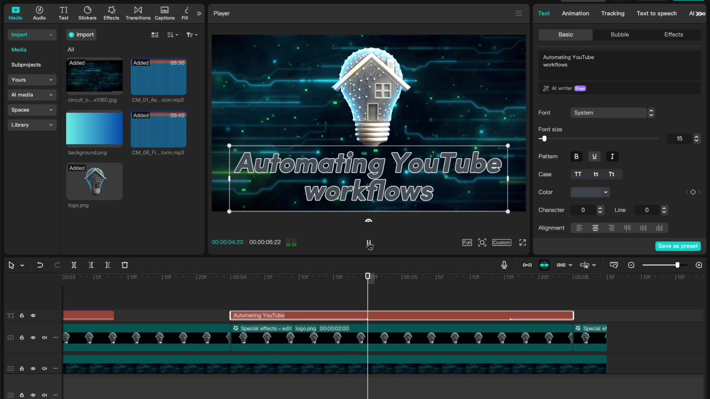
Right, let's talk about the editing. This is generally what takes the most time in the whole process. If any of you know a good way to speed this up, seriously, shout out in the comments because I'd love to hear your suggestions. I can imagine it won't be too long before an AI can do a half-decent job, but I don't think we're quite there yet. YouTubers who actually make money from their channels can afford to pay editors to handle this part. My channel doesn't really make money, so it's all down to me and my questionable editing skills. Be sure to hit like and subscribe if you want to support the channel. It generally makes a difference, and it might ultimately help fund my eventual editor hire or at least fuel my caffeine addiction.

I use CapCut for the actual editing, and I've got another small project that lets me quickly create intro titles and export them to pull into new videos. Again, this is all about removing friction and making the process as smooth as possible.

## Automated Publishing: Video to Blog Post

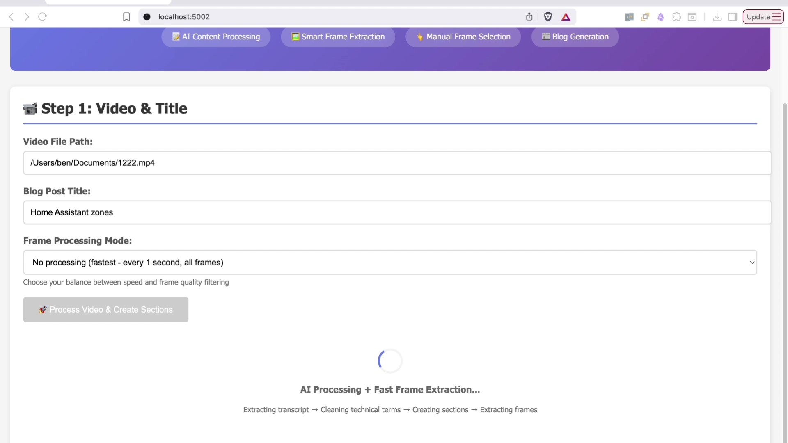
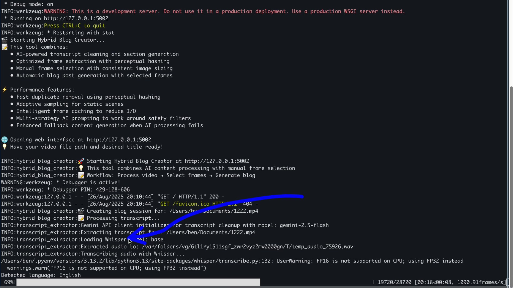

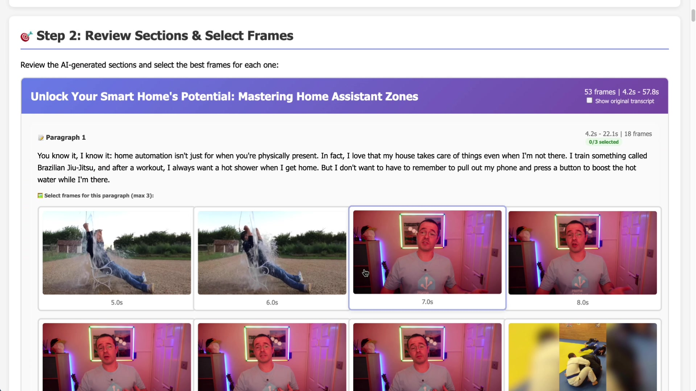
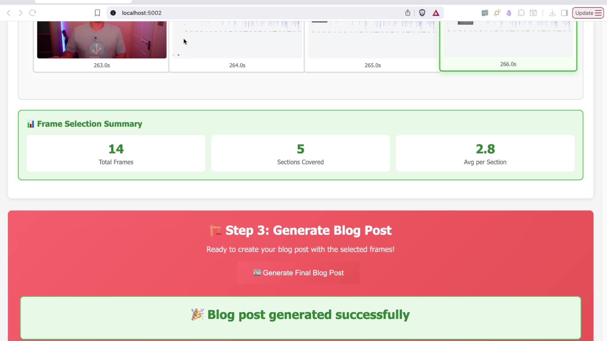

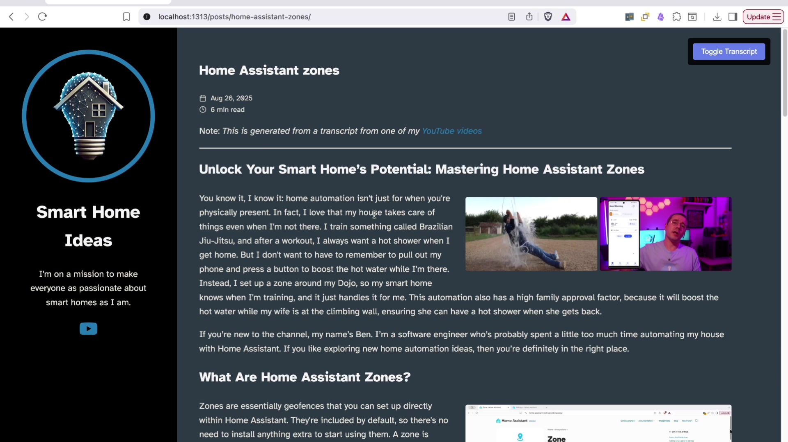
Once the video is edited and published, I run it through another script that generates a blog post automatically. This is something I built myself and open-sourced, so you can grab it for free. I'll add a link down in the description. The process uses OpenAI Whisper to extract transcripts from the video, cleans up the transcripts, and creates semantic sections. I can then select relevant images for each paragraph that I like the look of, and it will then generate a Hugo blog post based on a template I've set up. Once the blog post is created, I can check it locally with Hugo to make sure everything looks right. If I'm happy with it, I commit the changes and push them to Git. Cloudflare then automatically picks up the Hugo site and publishes it to smarthomeidears.info. This is probably a good time to mention, if you didn't know, I also publish a blog post alongside all of my YouTube videos so that anyone who prefers to read can still enjoy my content without having to listen to my voice.

## Post-Publishing Maintenance: The Affiliate Link Checker

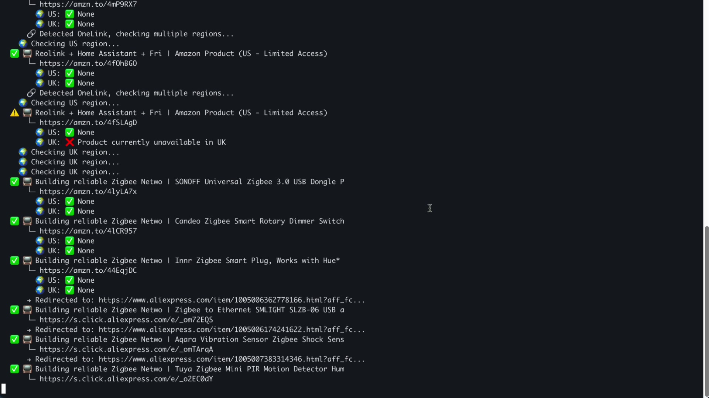
Finally, there's one more script I should mention: my affiliate link checker. This might seem like a small detail, but broken links are surprisingly common and can be quite annoying for viewers. This is something I've only recently made, but it feels like it rounds off the process quite nicely, and I'm pretty happy with it. The script scans both my YouTube videos and website for affiliate links, checks which ones are broken, and outputs a list so I can go and fix them. It's another one of those background maintenance tasks, so it's worth automating. This script is also available for free on my GitHub (link in description if you want to grab it), and it's also linked up on my website as well.

## Key Takeaways

It might seem like a lot of moving parts, but each piece solves a specific problem and removes friction from the creative process. The key insight is that good workflows aren't about having the fanciest tools; they're about identifying the repetitive or annoying parts of the process and finding ways to automate or streamline them. Don't forget to like and subscribe if you found this useful, and I'll catch you in the next one. Happy automating!

# Links:
- Ulanzi claw: https://s.click.aliexpress.com/e/_oE3xRxb
- Govee Glide Hexa: https://amzn.to/47NEub9

# Video

You can watch the full video on YouTube here:


# Support me to keep making videos


  
If you like the work I'm doing, please drop a like on the video, or consider subscribing to the channel.

In case you're in a particularly generous mood, you can fund my next cup of coffee over on [Ko-Fi](https://ko-fi.com/smarthomeideas)

The links from some of my videos are affiliate links, which means I get a small kickback at no extra cost to you. It just means that the affiliate knows the traffic came from me.

<!-- Image Modal for Click-to-Enlarge -->

    

        
        

    

    &times;

<!-- Transcript Toggle Functionality -->

    <button id="toggleBtn" style="background: #667eea; color: white; border: none; padding: 8px 16px; border-radius: 4px; cursor: pointer; font-size: 14px;">
        Toggle Transcript
    </button>

