+++
date = '2024-12-23T00:00:00Z'
title = 'Home Assistant zones'
+++

Note: _This is generated from a transcript from one of my [YouTube videos](https://www.youtube.com/@BensSmartHomeIdeas)_

---

# Unlock Your Smart Home's Potential: Mastering Home Assistant Zones

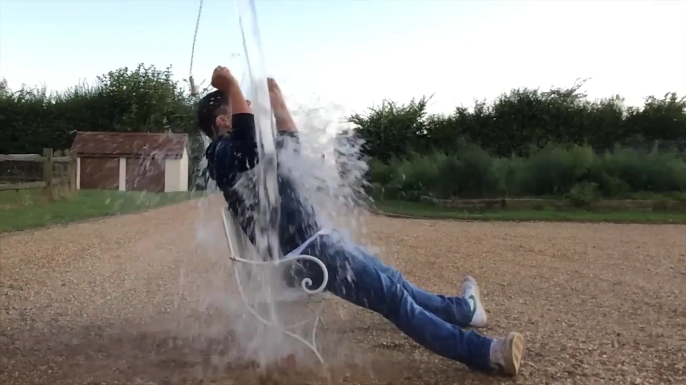
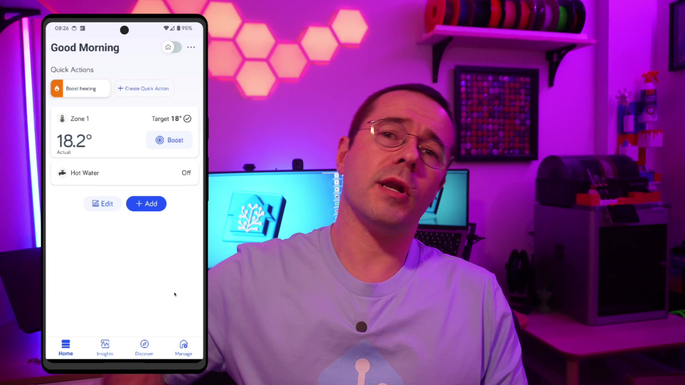

You know it, I know it: home automation isn't just for when you're physically present. In fact, I love that my house takes care of things even when I'm not there. I train something called Brazilian Jiu-Jitsu, and after a workout, I always want a hot shower when I get home. But I don't want to have to remember to pull out my phone and press a button to boost the hot water while I'm there. Instead, I set up a zone around my Dojo, so my smart home knows when I'm training, and it just handles it for me. This automation also has a high family approval factor, because it will boost the hot water while my wife is at the climbing wall, ensuring she can have a hot shower when she gets back.

If you're new to the channel, my name's Ben. I'm a software engineer who's probably spent a little too much time automating my house with Home Assistant. If you like exploring new home automation ideas, then you're definitely in the right place.

## What Are Home Assistant Zones?

Zones are essentially geofences that you can set up directly within Home Assistant. They're included by default, so there's no need to install anything extra to start using them. A zone is considered active for a user when their device, running the Home Assistant companion app, is within that geofence. There's some potential for them to be a little bit flaky, because some devices try to optimize their battery usage by limiting location updates. But don't worry, we'll get into that in more detail later in this post.

## Setting Up Your First Zone

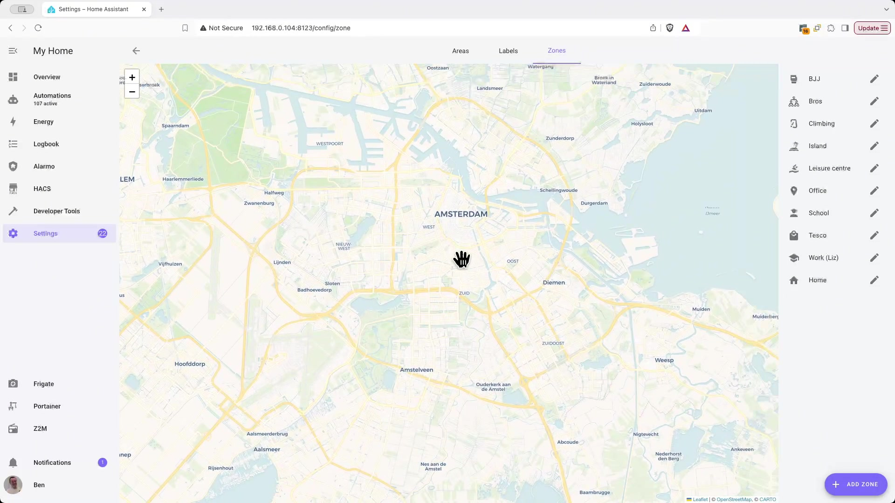
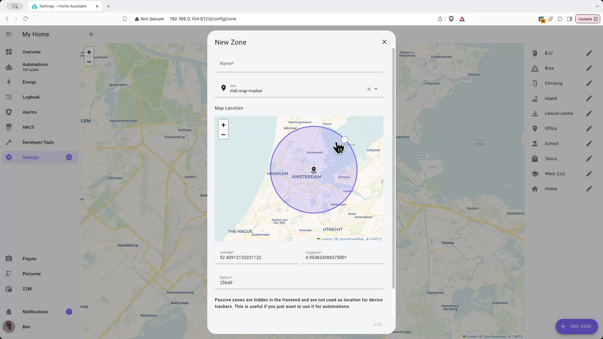

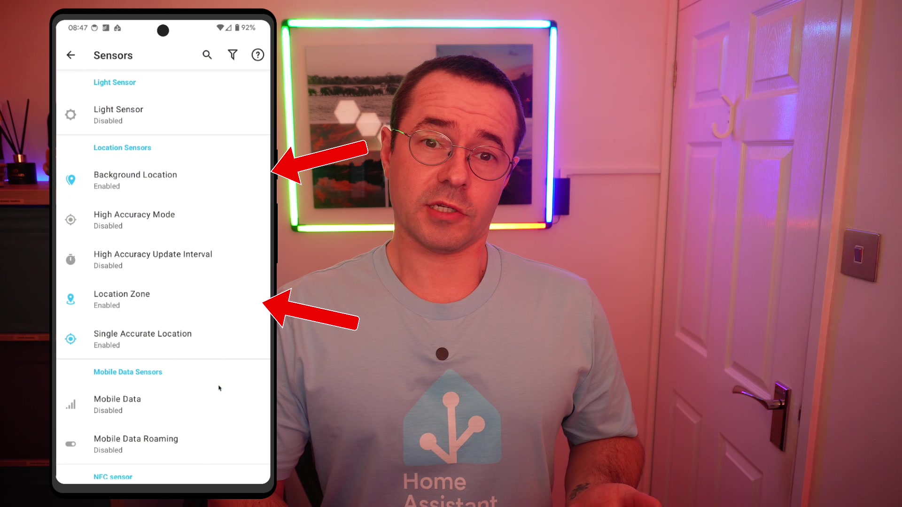
To set up a zone, you'll navigate to **Settings**, then **Areas, Labels & Zones**. Select the **Zones** tab and tap the **Add Zone** button. This will let you draw a circle to create the geofence around the area you're interested in.

The companion app needs to be running on your phone, and it's crucial to ensure it has access to location services. To do this, open the companion app's settings, go to **Manage Sensors**, scroll down to **Location Sensors**, and turn on both **Location Zone** and **Background Location**. Now that you're set up with zones and the companion app, you can start using them in your automations!

## Practical Automation Examples with Zones

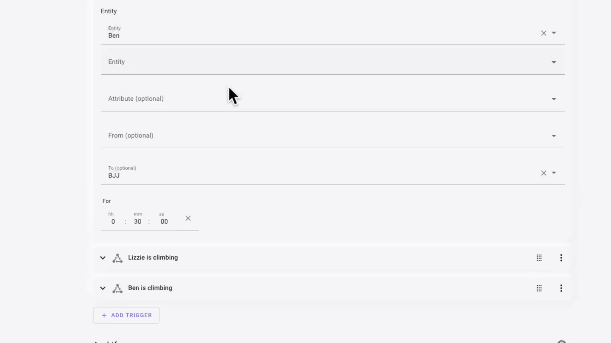
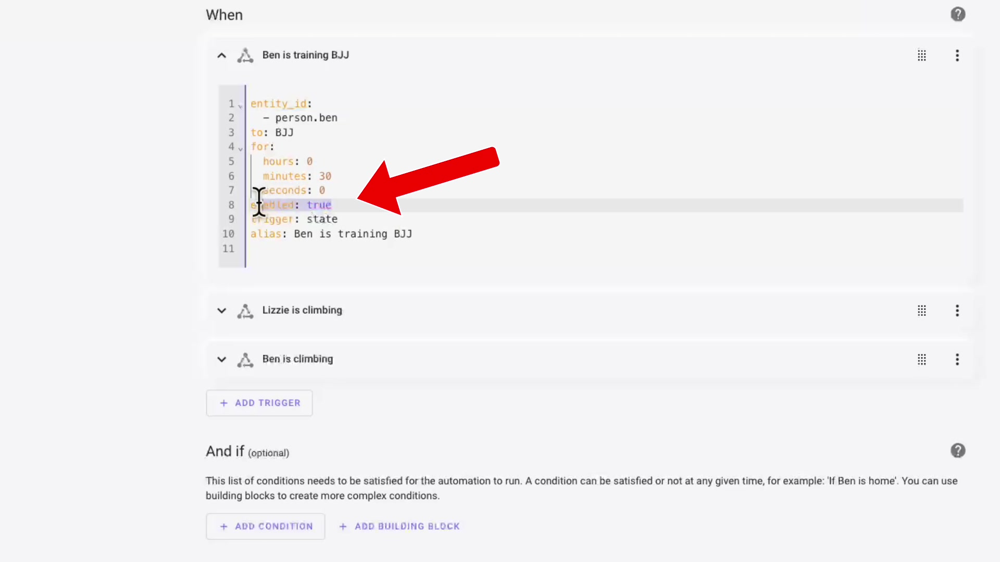

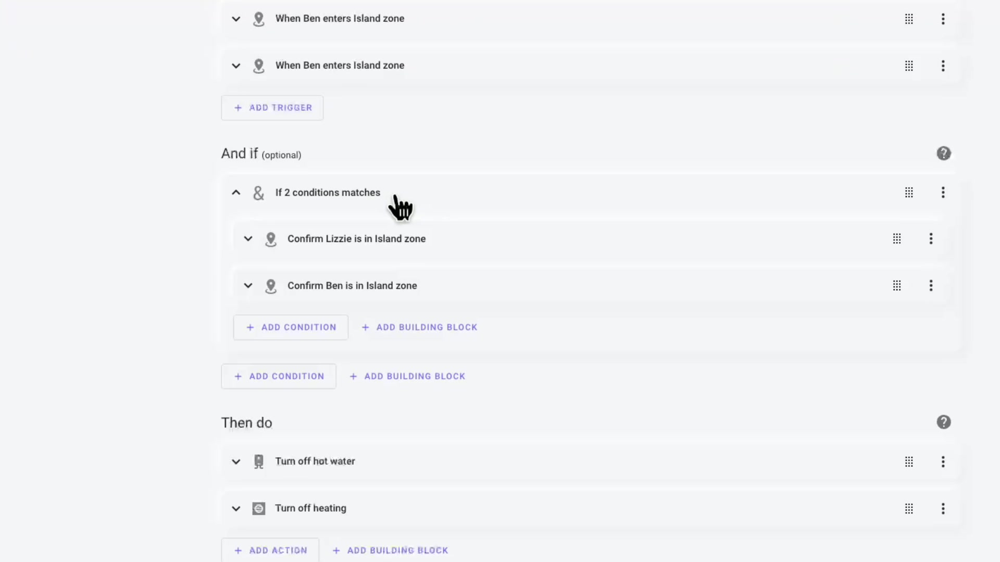
I've got a high-efficiency hot water system, and I'm using zones to manage it, but this would, of course, work for something like an Ecobee or similar smart thermostat. My automation is set up to make sure I've been dwelling in the zone for a little while before the hot water is boosted. I don't want to be driving past the dojo and have the boiler kick in and waste energy.

After quite a bit of trial and error, I realized that you have to explicitly set `enabled: true` in the trigger step for the automation for the geofence to actually work when you're adding some dwelling time.

I have a few other automations that don't use a dwell time, but they still leverage zones effectively. One of these automations will turn off potty reminders when I'm at the school drop-off. The idea is, if I've dropped the kid off at nursery, then I don't want to be reminded about using the potty. You know the drill: "Don't forget to let the tiny human take a potty break before it's a puddle party!"

Another automation will turn the heating off when we head to the in-laws. They live quite far away, and normally we visit for a couple of days, so it makes sense to turn off the hot water while we're there. The automation, of course, will do the reverse as well, so that the hot water gets turned on as we head home. This is superior by far to the basic home and away automations that you get with typical smart thermostats, because you can add in some smart geographic considerations around how long it will take the hot water to heat and how long for the house to warm up. You don't really want your heating to be turning back on *as* you get home; you want it to turn on so it's warm by the time that you arrive back.

## Optimizing Zone Performance on Android Devices

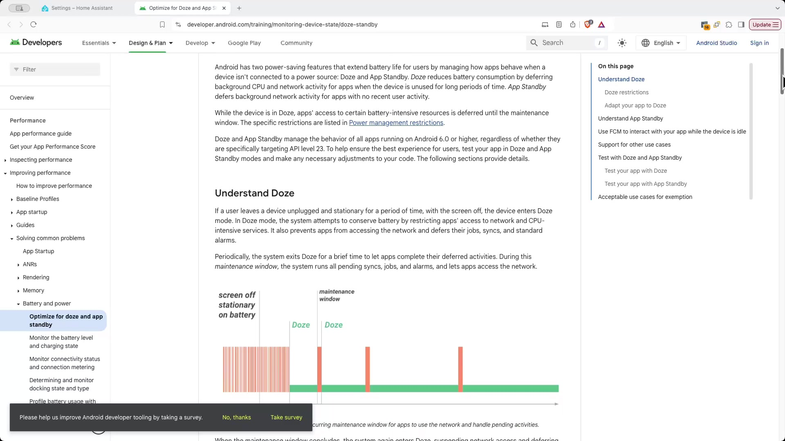
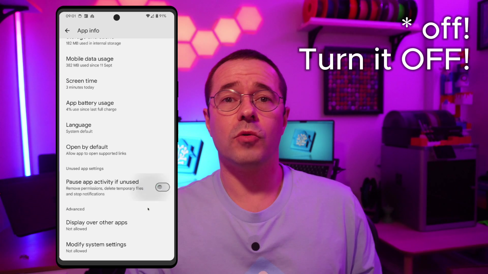

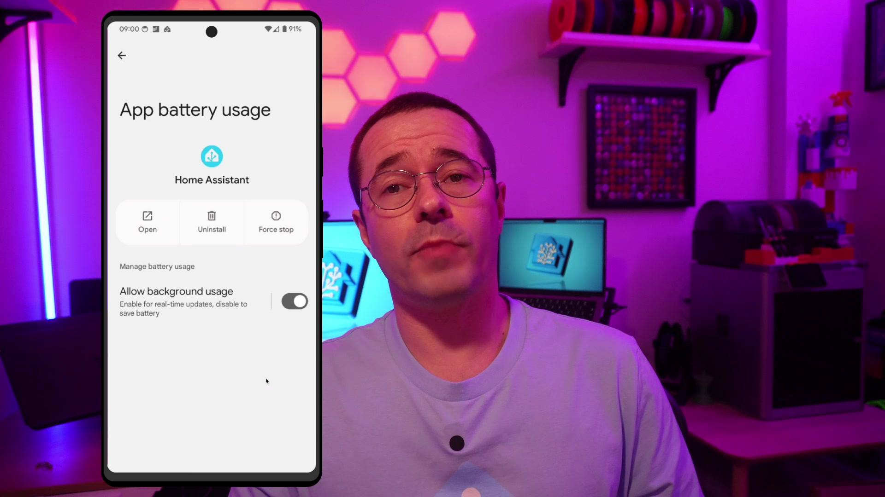
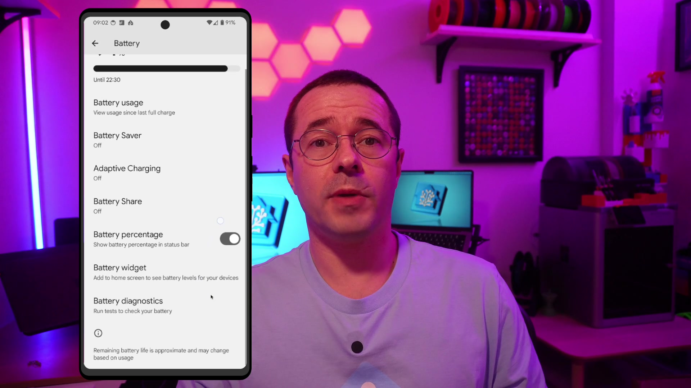

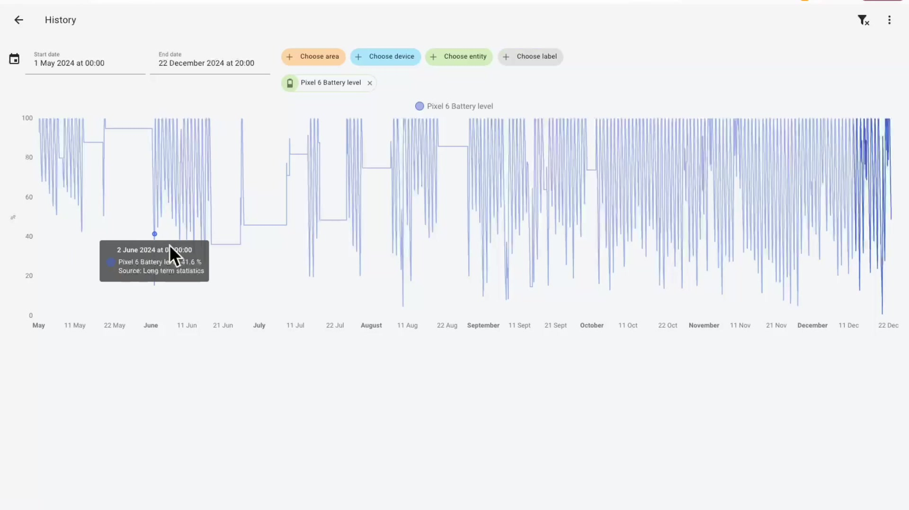
If you're using an Android phone, it's worth knowing that there's a feature called Doze Mode. I'll add some links down in the description if you want to read more, but basically, in a nutshell, if your phone detects that the screen is off and you're not doing anything, it will put it into a deeper sleep and then batch actions when it wakes up. Again, this means notifications can be delayed, and relevant to this video, location updates won't happen as frequently.

There are a few things you can change to make sure that your geofences are tripped in a timely manner.
1. First, go into the app info for the Home Assistant companion app and make sure you've turned off **Pause app activity if unused**.
2. Next, under **App battery usage**, make sure that you've turned on **Allow background usage**.
3. Finally, go into **Battery** and **Battery Saver** settings, open up **Adaptive Battery**, and make sure **Use adaptive battery** is turned off.

This will, of course, affect your battery life because your phone won't be entering Doze Mode as aggressively, but it will mean that you get notifications quicker in some cases and it will also trigger zones much more quickly. Depending on your setup, this might be a problem for you, but I'm still getting a full day of battery life with this setup. I enabled this setting a few months ago, and while there's a noticeable dip in the battery level, the improved responsiveness is worth it for me.

If you enjoyed this video, please throw a thumbs up down below – it really helps the channel out! And what are you using zones for if you've implemented them? Let me know down below in the comments. Until next time, I'll see you!

# Support me to keep making videos


  
If you like the work I'm doing, please drop a like on the video, or consider subscribing to the channel.

In case you're in a particularly generous mood, you can fund my next cup of coffee over on [Ko-Fi](https://ko-fi.com/smarthomeideas)

The links from some of my videos are affiliate links, which means I get a small kickback at no extra cost to you. It just means that the affiliate knows the traffic came from me.

# Video

You can watch the full video on YouTube here:


<!-- Image Modal for Click-to-Enlarge -->

    

        
        

    

    &times;

<!-- Transcript Toggle Functionality -->

    <button id="toggleBtn" style="background: #667eea; color: white; border: none; padding: 8px 16px; border-radius: 4px; cursor: pointer; font-size: 14px;">
        Toggle Transcript
    </button>

