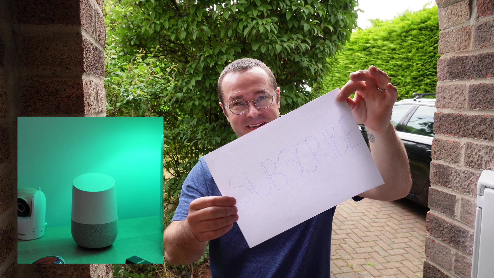

+++
date = '2025-06-02T00:00:00Z'
title = 'Smart doorbell AI announcements'
+++

Note: _This is generated from a transcript from one of my [YouTube videos](https://www.youtube.com/@BensSmartHomeIdeas)_

---

# Elevate Your Smart Doorbell: AI Vision Announcements with Home Assistant

<div style="display: flex; justify-content: center; gap: 5px; margin-left: 20px; margin-bottom: 15px; margin-top: 10px; width: 50%; float: right; flex-wrap: wrap;">


</div>
<div style="display: flex; justify-content: center; gap: 5px; margin-left: 20px; margin-bottom: 15px; margin-top: 10px; width: 50%; float: right; flex-wrap: wrap;">


</div>
I'm thrilled to share a fantastic upgrade that will revolutionize your smart home doorbell experience. We're diving into LLM Vision, a brilliant integration that empowers your Home Assistant to "see" and describe who's at your door using advanced AI vision. Imagine hearing, "A devilishly handsome, definitely not middle-aged man is at the door." You might initially think this sounds like a novelty, but trust me, once you start using it, you'll discover just how surprisingly useful this feature can be for your smart home setup. It can even handle scenarios like, "Ding Dong, they have already gone," or "Ding Dong, check the camera, their face is hidden." Let's get started!

## Getting Started: Google Cloud and Gemini API Setup

<div style="display: flex; justify-content: center; gap: 5px; margin-left: 20px; margin-bottom: 15px; margin-top: 10px; width: 50%; float: right; flex-wrap: wrap;">


</div>

First things first, we need to configure Gemini in Google Cloud. Don't worry if that sounds daunting; it's quite straightforward. You'll want to navigate to the Google Cloud Console and create a new project specifically for this purpose. Once your project is set up, the next crucial step is to enable the Gemini API. This API is the powerhouse behind your new AI vision capabilities.

Next, you'll need to obtain an API key from AI Studio. Simply head over to [AIStudio.google.com/app/APIkey](https://AIStudio.google.com/app/APIkey). I'll make sure to include that link in the description below for easy access. Click "Create API Key" and ensure you select the Google Cloud project you just configured. Keep this API key readily available, as we'll need it very soon.

## Installing the LLM Vision Integration

<div style="display: flex; justify-content: center; gap: 5px; margin-left: 20px; margin-bottom: 15px; margin-top: 10px; width: 50%; float: right; flex-wrap: wrap;">


</div>
<div style="display: flex; justify-content: center; gap: 5px; margin-left: 20px; margin-bottom: 15px; margin-top: 10px; width: 50%; float: right; flex-wrap: wrap;">


</div>
Now for the exciting part: installing the LLM Vision integration itself. You'll acquire this from HACS, the Home Assistant Community Store. I must commend the documentation available at [llmvision.gitbook.io](https://llmvision.gitbook.io) – it's truly excellent, so feel free to explore it for deeper insights. While there's a blueprint available, I opted not to use it because I wanted the system to process a single image rather than a video, which is significantly quicker. The entire process is quite snappy.

First, install it from HACS just like any other custom integration. After installation, give Home Assistant a quick restart. Then, you can install it as a standard integration directly through the Home Assistant interface. When prompted, paste the API key we obtained earlier and select "Google" as your provider. You've got this!

## Addressing Privacy Concerns


Before we proceed, let's address the elephant in the room: privacy. I know some of you might be thinking, "Hold on, this is sending images to the cloud. What about my family's privacy?" That's a completely valid concern. Since this is a remote LLM and not hosted locally, there's indeed a consideration about images being uploaded to Google's servers.

Here's how I've approached it in my setup: my kids won't be ringing the doorbell, so it should never capture images of them. Crucially, my automation is configured to trigger only when someone *actually rings* the doorbell, not merely when there's motion in front of the camera. This significantly limits what gets sent to the cloud.

## Building the Automation

<div style="display: flex; justify-content: center; gap: 5px; margin-left: 20px; margin-bottom: 15px; margin-top: 10px; width: 50%; float: right; flex-wrap: wrap;">


</div>
<div style="display: flex; justify-content: center; gap: 5px; margin-left: 20px; margin-bottom: 15px; margin-top: 10px; width: 50%; float: right; flex-wrap: wrap;">


</div>
<div style="display: flex; justify-content: center; gap: 5px; margin-left: 20px; margin-bottom: 15px; margin-top: 10px; width: 50%; float: right; flex-wrap: wrap;">


</div>

Alright, let's get into the fun part: integrating this into an automation. I already have a pretty neat automation that captures a picture from my video doorbell and sends a notification to my phone with the image every time someone presses the button. It also announces that the doorbell was rung throughout the house on various Google Home devices, which is super handy if you're upstairs and can't hear the physical doorbell. My goal is to enhance this existing automation so it can describe what it sees.

The magic happens when we introduce a new action called `llmvision.image_analyzer`, which is provided by the integration we just added. Let me walk you through the configuration that makes this work. We're utilizing the `llmvision.image_analyzer` action with some specific parameters that I've found to be very effective.

I've set the `max_tokens` to 50 to ensure the responses remain concise. A "token" is essentially a word, so this limits the description to about 50 words. I've also set the `temperature` to 0.2 for more consistent results. The temperature parameter ranges from 0 to 1; a value closer to 1 encourages more creative and varied responses, while a value closer to 0 yields more precise and consistent output. I've fine-tuned mine to 0.2, though I did experiment with 1 to try and get more interesting results – your mileage may legitimately vary! For the model, I'm using the Gemini 2.0 Flash model, primarily because it's quite capable and, importantly, it's free.

## Crafting the AI Prompt: Prompt Engineering


Here's where it gets truly fascinating: prompt engineering. This is where you instruct the AI exactly what to look for and how to respond. I've carefully crafted a prompt that handles various common scenarios quite well. This is the exact prompt I use that has given me excellent results:

```
This is a picture from a video doorbell.
If there is nobody there say they have already gone and nothing else.
Otherwise if they're walking away say they have already gone and nothing else.
Otherwise if they're faces hidden say check the camera, they're faces hidden and nothing else.
Otherwise if none of the above true then say a adjective, man/woman who looks like famous actor which I thought was quite fun.
Holding whatever they're holding is at the door.
```
The reason for being so explicit with the prompt, including phrases like "and nothing else," is to prevent the AI from generating multiple, lengthy responses. I particularly love this approach because it effectively covers the most common situations you'll encounter. Sometimes people ring the bell and immediately walk away, perhaps dropping off a package or simply in a hurry. Other times, you might have someone whose face is obscured by a hood or mask, which is definitely valuable information to have before you open your front door.

## The Results and Customization


The results have been surprisingly accurate and, I must admit, quite entertaining! I tweaked the prompt a little after it consistently told me there was a "middle-aged man" at the door during my testing, and now it frequently tells me I look like Matt Damon. Brilliant! It has quickly become one of my favorite subtle enhancements in my smart home setup. Instead of a generic "doorbell pressed" announcement, you receive this wonderfully descriptive message that provides useful context about who's there. For example, "A man who wants you to subscribe is waving a sign around."

If you're considering implementing this yourself, I highly recommend starting with a basic setup and then fine-tuning the prompts to align with your specific needs. Perhaps you desire more detailed descriptions, or maybe you prefer to focus on particular elements like packages or uniforms. The possibilities for customization are vast!

What do you think? Are you going to give this a try in your own smart home setup? Let me know in the comments below what creative prompts you come up with! If you found this helpful, as always, don't forget to give it a thumbs up and subscribe for more smart home content. Thanks for watching, and I'll see you in the next one!

# Links:
I'm using a Reolink PoE video doorbell, which I highly recommend: https://amzn.to/4knsj8D

Here's a link to Google AI studio: https://aistudio.google.com/app/apikey
This is the llm vision integration documentation: https://llmvision.gitbook.io/getting-started

This is the prompt that I used to get good results:
```
This is a picture from a video doorbell.

If is nobody there say "they have already gone" and nothing else.
Otherwise, If they are walking away say "they have already gone" and nothing else.
Otherwise, If their face is hidden say "Check the camera, their face is hidden." and nothing else.
Otherwise, If none of the previous are true, say "A {adjective} {man/woman} who looks like {famous actor} holding {what they are holding} is at the door"
```

And here's the complete YAML of the automation:
```yaml
alias: Notifications - Doorbell
description: ""
triggers:
  - type: turned_on
    device_id: 60f0f7dba756a82ed054ec8200829078
    entity_id: bd8e8bfd2b39fb7832bbc6cdd5df0fb3
    domain: binary_sensor
    trigger: device
conditions: []
actions:
  - delay:
      hours: 0
      minutes: 0
      seconds: 0
      milliseconds: 500
  - action: camera.snapshot
    metadata: {}
    data:
      filename: /config/www/reolink_snapshot/last_snapshot_doorbell.jpg
    target:
      entity_id: camera.reolink_video_doorbell_poe_fluent
    enabled: true
  - action: llmvision.image_analyzer
    data:
      include_filename: false
      max_tokens: 50
      provider: 01JW3EN2J5JB2HVCN7DH6H8269
      image_file: /config/www/reolink_snapshot/last_snapshot_doorbell.jpg
      model: gemini-2.0-flash
      message: This is a picture from a video doorbell.


        If is nobody there say "they have already gone" and nothing else.

        Otherwise, If they are walking away say "they have already gone" and
        nothing else.

        Otherwise, If their face is hidden say "Check the camera, their face is
        hidden." and nothing else.

        Otherwise, If none of the previous are true, say "A {adjective}
        {man/woman} who looks like {famous actor} holding {what they are
        holding} is at the door"
      temperature: 0.2
    response_variable: vision_result
  - action: notify.mobile_app_pixel_9_pro
    metadata: {}
    data:
      title: Doorbell
      message: "{{ vision_result.response_text }}"
      data:
        image: /local/reolink_snapshot/last_snapshot_doorbell.jpg
        clickAction: app://com.mcu.reolink
    enabled: true
    alias: Notify Ben's phone
  - action: tts.speak
    target:
      entity_id: tts.home_assistant_cloud
    data:
      cache: true
      media_player_entity_id: media_player.kitchen
      message: Ding dong. {{ vision_result.response_text }}
    enabled: true
    alias: Notify kitchen speaker
mode: single
```

# Video

You can watch the full video on YouTube here:


# Support me to keep making videos


  
If you like the work I'm doing, please drop a like on the video, or consider subscribing to the channel.

In case you're in a particularly generous mood, you can fund my next cup of coffee over on [Ko-Fi](https://ko-fi.com/smarthomeideas)

The links from some of my videos are affiliate links, which means I get a small kickback at no extra cost to you. It just means that the affiliate knows the traffic came from me.

<!-- Image Modal for Click-to-Enlarge -->
<style>
/* Modal responsive styles for better mobile experience */
#imageModal {
    display: none;
    position: fixed;
    z-index: 1000;
    left: 0;
    top: 0;
    width: 100%;
    height: 100%;
    background-color: rgba(0,0,0,0.8);
    cursor: pointer;
}

#imageModal .modal-content {
    position: absolute;
    top: 50%;
    left: 50%;
    transform: translate(-50%, -50%);
    max-width: 98%;
    max-height: 95%;
    padding: 0;
    margin: 0;
}

#imageModal #modalImage,
#imageModal .modal-content #modalImage,
.post-content #imageModal #modalImage {
    width: auto;
    height: auto;
    max-height: 92vh;
    max-width: 95vw;
    min-width: 80vw;
    min-height: 60vh;
    object-fit: contain;
    border-radius: 8px;
    box-shadow: 0 4px 20px rgba(0,0,0,0.5);
    display: block;
}

#modalCaption {
    color: white;
    text-align: center;
    margin-top: 10px;
    font-size: 16px;
    padding: 0 10px;
}

.modal-close {
    position: absolute;
    top: 15px;
    right: 20px;
    color: white;
    font-size: 40px;
    font-weight: bold;
    cursor: pointer;
    user-select: none;
    z-index: 1001;
}

/* Mobile optimizations */
@media (max-width: 768px) {
    #imageModal .modal-content {
        max-width: 99%;
        max-height: 98%;
    }
    
    #imageModal #modalImage,
    #imageModal .modal-content #modalImage,
    .post-content #imageModal #modalImage {
        max-height: 95vh;
        max-width: 98vw;
        min-width: 90vw;
        min-height: 70vh;
        border-radius: 4px;
    }
    
    #modalCaption {
        font-size: 14px;
        margin-top: 8px;
    }
    
    .modal-close {
        top: 10px;
        right: 15px;
        font-size: 35px;
    }
}

/* Ultra-small screens (phones in portrait) */
@media (max-width: 480px) {
    #imageModal .modal-content {
        max-width: 100%;
        max-height: 100%;
    }
    
    #imageModal #modalImage,
    #imageModal .modal-content #modalImage,
    .post-content #imageModal #modalImage {
        max-height: 98vh;
        max-width: 99vw;
        min-width: 95vw;
        min-height: 80vh;
        border-radius: 2px;
    }
    
    .modal-close {
        top: 5px;
        right: 10px;
        font-size: 30px;
    }
}
</style>

<div id="imageModal" onclick="closeImageModal()">
    <div class="modal-content">
        
        <div id="modalCaption"></div>
    </div>
    <span class="modal-close" onclick="closeImageModal()">&times;</span>
</div>

<script>
function openImageModal(src, alt) {
    document.getElementById('imageModal').style.display = 'block';
    document.getElementById('modalImage').src = src;
    document.getElementById('modalCaption').textContent = alt;
    document.body.style.overflow = 'hidden';
}

function closeImageModal() {
    document.getElementById('imageModal').style.display = 'none';
    document.body.style.overflow = 'auto';
}

// Close modal on Escape key
document.addEventListener('keydown', function(event) {
    if (event.key === 'Escape') {
        closeImageModal();
    }
});
</script>

<!-- Transcript Toggle Functionality -->
<div id="contentToggle" style="position: fixed; top: 20px; right: 20px; z-index: 999; background: rgba(0,0,0,0.8); padding: 10px; border-radius: 5px;">
    <button id="toggleBtn" style="background: #667eea; color: white; border: none; padding: 8px 16px; border-radius: 4px; cursor: pointer; font-size: 14px;">
        Toggle Transcript
    </button>
</div>

<script>
let showingTranscript = false;
const toggleBtn = document.getElementById('toggleBtn');

// Store transcript data for sections
const transcriptData = [["Today I am super excited to show you something pretty neat that's going to take your smart home doorbell game to the next level. We are talking about LLM Vision, it's a brilliant integration and it lets your smart home assistant actually see and describe who's at your door using AI Vision. A devilishly handsome, definitely not middle aged man is at the door.", "Now I know you might be thinking isn't this just a bit of a gimmick but trust me once you start using it you'll actually see he just help surprisingly useful this can be for your smart home setup. Ding Dong, they have already gone. Ding Dong, check the camera, their face is hidden. So let's get into it.", "Okay first things first we need to get Gemini setup in Google Cloud and don't worry if that puts you off a bit it's pretty straightforward. We'll want to head over to Google Cloud Console and create a new project for this. Once you've got your project sorted you need to enable the Gemini API. This is what's going to power your AI vision capabilities.", "Next up need to grab an API key from AI Studio. Just head over to AIStudio.google.com slash app slash API key. I'll pop that link down in the description below so you can get it easily."], ["I'll pop that link down in the description below so you can get it easily. Hit create API key and make sure that you choose the Google Cloud project that is just being set up. Keep that API key handy because we're going to need it in just a moment.", "Now for the fun bit, installing the actual integration. You need to grab this from Hax which is the Home Assistant Community Store. I've got to say the documentation over on llmvision.getbook.io is absolutely brilliant so if you want to dive deeper you can head there as well. There's a blueprint there which you can use too. The reason I didn't use the blueprint is basically because I wanted an image that will be much much quicker to process than a video.", 'The process is pretty snappy itself so first install it from Hax like any other custom integration. Give Home Assistant a restart and then you can install it as a standard integration through the Home Assistant interface. Paste that API key that we grabbed earlier and choose Google as your provider.', "Now before we go any further let's talk about the elephant and room privacy. I know some of you might be thinking hang on this is sending images to the cloud. What about my family's privacy? That's a totally valid concern. The thing is because this is a remote llm and not hosted locally there's that consideration about images being uploaded to Google servers all the time."], ["Here's the thing in my setup. My kids aren't going to be ringing the doorbell so it should never capture images of them. The automation will only trigger when somebody actually rings the doorbell and not when there's motion in front of the camera. Right let's get into the fun bit actually using this in an automation. I've already got a pretty neat automation that takes a picture from the video doorbell and sends a notification to my phone with the image every time someone presses the button.", "It will also announce that the doorbell was run around the house on various Google homes which is quite handy if you're upstairs and you can't actually hear the doorbell. What I'm going to do is add to that existing automation so that it can then describe what it sees. The magic happens when we perform a new action called llm vision image analyzer which is provided by the integration that we added earlier.", "Let me show you the configuration that makes this work. We're using llmvision.image.analyzer action with some specific parameters that I found work really well. I've set the max tokens to 50 to keep the responses concise. A token is effectively a word so that's about 50 words and I've set the temperature to 0.2 for more consistent results. It goes from 0 to 1 and it will be more creative around the range of 1 and more precise around the range of 0."], ["It goes from 0 to 1 and it will be more creative around the range of 1 and more precise around the range of 0. I've tuned it to 0.2 and I played around with 1 as well to try and get more interesting results but you're my legitimate vary. I'm using the Gemini 2.0 flash model largely because it's pretty good and it's free.", "Here's where it gets really interesting, the prompt engineering. This is where retail AI is exactly what we want to look for and how to respond. I've crafted a prompt that handles different scenarios quite well. This is the prompt that I use that I got pretty good results from. This is a picture from a video doorbell. If there is nobody there say they have already gone and nothing else.", "Otherwise if they're walking away say they have already gone and nothing else. Otherwise if they're faces hidden say check the camera, they're faces hidden and nothing else. Otherwise if none of the above true then say a adjective, man slash woman who looks like famous actor which I thought was quite fun.", "Holding whatever they're holding is at the door. The reason for being very explicit with the prompt and saying things like and nothing else is so that you don't get multiple responses which end up just running on for a long time."], ["The reason for being very explicit with the prompt and saying things like and nothing else is so that you don't get multiple responses which end up just running on for a long time. I particularly love this approach because it handles the most common scenarios you'll encounter. Sometimes people ring the bell and they walk away immediately, maybe they're dropping off a package or they're in a hurry.", 'Other times you might get someone with their face obscured by your hood or mask which is definitely worth knowing about before you open the front door. The results have been surprisingly accurate and quite entertaining. I tweaked the prompt a little bit after it kept telling me there was middle age man at the door during my testing and now it keeps telling me I look like Matt Damon.', "Brilliant. It's become one of my favourite little touches in the smart home setup. Instead of getting a generic doorbell pressed announcement you get this lovely descriptive message. Let tells you something useful about who's there.", "A man who wants you to subscribe is waving a sign around. If you're thinking about implementing this for yourself then I definitely recommend starting with a basic setup and then tweaking the prompts to match your specific needs. Maybe you want more detailed descriptions or perhaps you prefer to focus on specific things like packages or uniforms.", "What do you think? Are you going to give this a try in your own smart home setup? Let me know in the comments down below what creative prompts you come up with and if you found this helpful, as ever, don't forget to give it a thumbs up and subscribe for more smart home content. Thanks for watching and I'll see you in the next one."]];

// Store original content for each section
const originalSectionContent = {};

// Initialize: find all sections and store their original content
document.addEventListener('DOMContentLoaded', function() {
    const sections = document.querySelectorAll('h2, h3');
    sections.forEach((header, index) => {
        // Find all content between this header and the next header
        const sectionContent = [];
        let nextElement = header.nextElementSibling;
        
        while (nextElement && !nextElement.matches('h2, h3')) {
            if (nextElement.tagName === 'P' || nextElement.tagName === 'DIV') {
                sectionContent.push(nextElement);
            }
            nextElement = nextElement.nextElementSibling;
        }
        
        // Store original content for each paragraph in this section
        const sectionId = header.textContent.toLowerCase().replace(/[^a-z0-9]/g, '-');
        originalSectionContent[sectionId] = [];
        
        sectionContent.forEach(element => {
            originalSectionContent[sectionId].push({
                element: element,
                originalHTML: element.innerHTML
            });
        });
    });
});

toggleBtn.addEventListener('click', function() {
    const sections = document.querySelectorAll('h2, h3');
    
    sections.forEach((header, sectionIndex) => {
        const sectionTitle = header.textContent.trim();
        const sectionId = sectionTitle.toLowerCase().replace(/[^a-z0-9]/g, '-');
        
        // Find paragraphs in this section
        const sectionContent = [];
        let nextElement = header.nextElementSibling;
        
        while (nextElement && !nextElement.matches('h2, h3')) {
            if (nextElement.tagName === 'P' || nextElement.tagName === 'DIV') {
                // Skip image containers
                if (!nextElement.querySelector('img') && nextElement.innerText.trim().length > 20) {
                    sectionContent.push(nextElement);
                }
            }
            nextElement = nextElement.nextElementSibling;
        }
        
        if (showingTranscript) {
            // Switch back to formatted content
            if (originalSectionContent[sectionId]) {
                originalSectionContent[sectionId].forEach(item => {
                    item.element.innerHTML = item.originalHTML;
                });
            }
        } else {
            // Switch to transcript content
            const transcriptForSection = transcriptData[sectionIndex] || [];
            
            sectionContent.forEach((element, paragraphIndex) => {
                if (transcriptForSection[paragraphIndex]) {
                    element.innerHTML = transcriptForSection[paragraphIndex];
                }
            });
        }
    });
    
    showingTranscript = !showingTranscript;
    toggleBtn.textContent = showingTranscript ? 'Show Formatted' : 'Toggle Transcript';
});
</script>