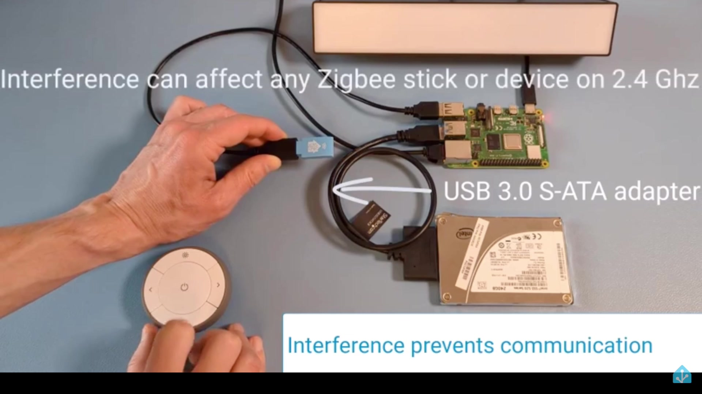
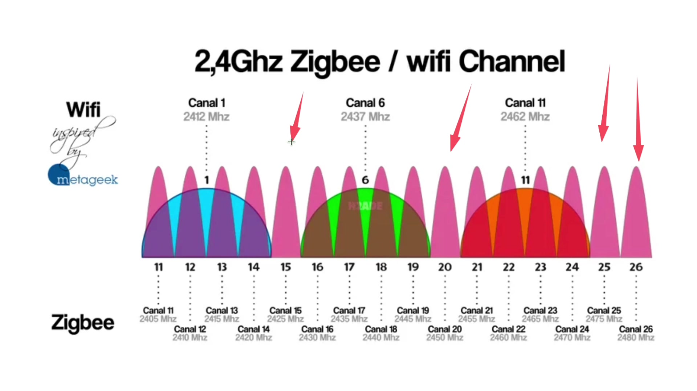
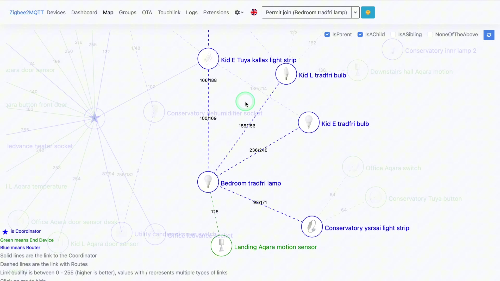

+++
date = '2025-08-02T00:00:00Z'
title = 'Troubleshooting zigbee networks'
+++

Note: _This is generated from a transcript from one of my [YouTube videos](https://www.youtube.com/@BensSmartHomeIdeas)_

---

# Troubleshooting Zigbee Networks

Want to build a solid ZigBee network that works reliably? Or perhaps you're currently battling an existing mesh network that just won't cooperate. Either way, you've landed in the right spot! Today, I'm going to walk you through everything from the absolute basics, like why your coordinator's placement is so crucial, all the way through to deciphering errors in your log files. We'll cover coordinators, the difference between routers and end devices, channel selection, interference, and yes, we'll even dive into those log files that people often overlook. Trust me, they play a key role in diagnosing issues and building a rock-solid setup. As we go, the topics will get progressively more advanced, so stick with me!

## The Foundation: Your ZigBee Coordinator

Let's dive straight into the foundation of your network: your coordinator. I truly can't stress this enough: your coordinator is essentially the brain of your entire ZigBee network. Pick a poor one, and you'll likely be fighting connectivity issues for months. Choose a good one, and everything just seems to work – well, mostly! We'll get into the nuances.

When it comes to selecting a coordinator, you absolutely need to do your research. And I mean *properly* research it. Don't just grab the first cheap USB stick you find on Amazon. Instead, read reviews, check compatibility, and explore community forums. The few extra pounds you spend here will save you weeks of frustration down the line.

Currently, I'm using the SLZB 06M. I'll include a link for it in the description below. It's not actually a USB stick; it's a Power over Ethernet (PoE) coordinator, and I absolutely love it. I would highly recommend it. It's been incredibly rock-solid for me, and the range is fantastic.

But here's the thing: even if you have the best coordinator in the world, its placement matters more than you might think. We'll cover that in a bit more detail later in this post.

### The USB Extension Cable Lifesaver

If you're using a USB coordinator – and many of you are – you absolutely need to use a USB extension cable. Why? Because USB 3 ports can cause electromagnetic interference (EMI) that disrupts your ZigBee channel. This isn't some theoretical problem either; it's a very real issue. There's an excellent video demonstrated by the team at Nabu Casa that clearly shows how moving a USB 3 cable closer to a coordinator can actually stop it from working.

This is the kind of subtle issue that will drive you absolutely mad, trying to figure out why your devices keep dropping offline. It's often erratic and incredibly difficult to troubleshoot. So, definitely make sure you're using a shielded extension cable. A simple extension cable costs next to nothing, and it can literally save your entire network.

### Optimal Coordinator Placement

Beyond the cable, think about placing your coordinator away from USB 3 ports and ideally somewhere central in your home. Consider your home's layout: where are your devices actually going to be, and what obstacles will be between them? A central location on the ground floor might not help much if half of your devices are upstairs. If the middle of your house is surrounded by solid walls, remember that 2.4 GHz signals might not travel through them particularly well.

## Understanding Device Limits and Mesh Networks

Now, here's something that catches a lot of people out: connecting devices directly to your coordinator might seem fast and convenient, but be aware that coordinators have a device limit. You should always check the documentation for your specific coordinator to find its exact device limit. This is generally fine when you're just starting out with your ZigBee network and have a handful of devices. However, if you get hooked and end up with 80 devices on your network, you'll start to see problems. What you're ultimately aiming for is a robust mesh network.

## Channel Selection: A Critical Decision

Let's talk about something that will save you massive headaches if you get it right from the start: channel selection. ZigBee operates on the 2.4 GHz frequency, which is the same frequency as your Wi-Fi, your microwave, and half the other electronics in your house. The key is finding a channel that doesn't clash with everything else.

I highly recommend using an app like Wi-Fi Analyzer (again, there's a link in the description) to check what channels your surrounding 2.4 GHz Wi-Fi networks are using. You want to pick a ZigBee channel that's as far away from busy Wi-Fi channels as possible.

Here's the critical bit: make this decision at the very beginning. If you change your ZigBee channel later, you'll have to re-pair every single device in your network. Trust me, you absolutely don't want to have to do that with 50-plus devices!

## ZigBee Device Types: Routers vs. End Devices

Now, let's get into the integrity of how the network actually works. You've got three types of devices: your coordinator (which we've covered), and then you also have routers and end devices. Understanding the difference is crucial for building a reliable network.

**Routers** are typically devices that have constant power, such as your smart plugs, light switches, and smart bulbs. Be careful, though, because not all powered devices are routers. You should definitely check the documentation for each device, as it's a dangerous assumption to make that all powered devices will be routers. Some manufacturers make mains-powered devices that only act as end devices, which is pretty useless for building a strong mesh network. I got caught out here by buying some of the Eukara H1 light switches, assuming they would work as routers.

**End devices** are your battery-powered sensors, like motion sensors, door sensors, and temperature sensors – that kind of stuff. These little guys don't route traffic like other devices. They simply connect to your network and send their data, but they won't route packets for other devices.

Typically, devices can connect to any router in range. However, some devices can be quite picky about which routers they connect to. If you try to pair your device in its final position, that tends to help with the routing. Don't pair them next to your coordinator and then move them across the house. They'll try to maintain that original connection, even if there's a better route nearby.

## The ZigBee Mesh: Patience is Key

Now, the mesh itself is where ZigBee gets really clever. ZigBee devices form their mesh automatically. It sounds great, and it is, but there's something that most people don't realize: it takes time. And I'm not just talking hours or even days; some ZigBee networks can take weeks to fully establish themselves and become optimized. This is probably the hardest part for most people because everyone wants things to work perfectly right away. But your devices are constantly learning about each other, figuring out the best routes, and adapting to changes in their environment. Patience is absolutely key here.

### Dealing with "Sticky" Devices

Something that may well save you hours of troubleshooting is knowing that some devices are what I call "sticky." Aqara devices are notorious for this. They latch onto the first router they connect to and refuse to jump to a better router, even if the signal strength is terrible. That's why pairing in the final position for these kinds of devices is especially important.

Also, don't overload your routers. They have limits on how many devices they can handle, typically. The good news is you can actually pair end devices with specific routers if you know what you're doing. I use Zigbee2MQTT, and there's an option to open up pairing on the network for specific devices, so I highly encourage trying that out.

## Advanced Troubleshooting: Diving into Log Files

Okay, this is what separates the beginners from the advanced users: deep diving into log files. Most people tend to ignore their logs, but the logs are basically telling you a story about what's happening on your network. Trust me, once you know how to read them, troubleshooting becomes so much easier.

Let me show you an example. Here, I have the entire database with all of my ZigBee devices. We've got the configuration, which basically gives us a mapping of those ZigBee devices to a friendly name, and then we have the log file, which is where all the fun things are happening.

If we look at a "root error many to one failures" entry, and use this as an example of something that's going wrong, you'll see it happens quite a lot throughout the logs. This is one of the things we wanted to dive into, but there are so many instances of this log entry, and we don't really want to go through and manually figure out how often this is happening.

So, what we're going to do is take the log file, and we're going to use the ID that we get from here. We'll figure out from that ID that it's a particular manufacturing device or a device with this manufacturing name. It's going to give us an IEEE address, and then we can use that IEEE address to look up in here what the friendly name is. For example, you can see here it's the "Snug LED Vance socket." So, we can map this error, which happens a lot for this particular ID, all the way back to the Snug LED Vance socket.

I don't want to do that manually, so I'm going to use my friend Claude (an AI assistant). Here's what I made earlier: I've uploaded a bunch of my old log files and old configurations so you can see the "before and after." I've basically taken this prompt and said, "Using the old logs, the old configurations, and the old database, find this particular error and various other errors, and then go through and basically do all of that mapping." This way, we can figure out what it looks like. Claude is going to go through and do its magic, and we're basically going to get this artifact. It's going to tell us the friendly name, the IEEE address, and basically the errors, how critical those errors are, how often they're occurring in the logs, and stuff like that. So, you can leverage this quite easily to figure out what's going on with your network.

I also used, if I go back to my network, the newer version after I've basically gone through and fixed a bunch of my issues. I ran the same analysis and basically got a similar result, but you can see here the numbers are much lower. There are basically only some very, very low-severity errors. Some of them were actually due to things like configuration timeouts, and Claude is very useful here and basically tells me this is not much of an issue. It's a fairly transient issue that happens during startup, and it's going to give me a few recommendations. In conclusion, the cleanup was highly successful – brilliant!

So, I'm still going to use the logs, and I'm going to look through them to get some hints on what I might be looking for. Then, I'm just going to use AI to help me enumerate those instances and figure out what needs to happen next.

## Final Thoughts

Look, building a reliable ZigBee network isn't rocket science, but it does require a bit of patience and understanding of how these devices actually work together. Start with a good coordinator, choose your channels carefully, understand the difference between routers and end devices, and most importantly, learn to read your logs. Do this right, and you'll have a great network that's incredibly reliable, responsive, and just works. Get it wrong, and you'll be constantly fighting connectivity issues and wondering why your smart home feels like a dumb home.

If this post helped you out, don't forget to hit that like button and subscribe for more smart home content. Check out the description for links I mentioned, and leave a comment down below: what's your biggest ZigBee challenge? Did I cover everything, or do you think I missed anything? Let me know! I read every comment and often turn them into future videos, so don't be shy. Until next time, happy automating, and I'll catch you in the next one!

# Links:
Here are the links mentioned in the video:
- WiFi analyser - https://play.google.com/store/apps/details?id=abdelrahman.wifianalyzerpro&hl=en_GB
- SMLight slzb06m - https://s.click.aliexpress.com/e/_om72EQS
- Home Assistant video showing USB 3 interference - https://www.youtube.com/watch?v=tHqZhNcFEvA

Here are some of the zigbee devices I'm using in my network:
- Innr smart plugs - https://amzn.to/44EqjDC
- Sonoff USB coordinator - https://amzn.to/4lyLA7x
- Candeo dimmer switches - https://amzn.to/4lCR957
- LEDVance smart plug - https://amzn.to/44U9zH7
- Aqara vibration sensors - https://s.click.aliexpress.com/e/_omTArqA
- Tuya motion sensors - https://s.click.aliexpress.com/e/_o2EC0dY
- Tuya buttons - https://s.click.aliexpress.com/e/_olnvxnY
- Tuya contact sensors - https://s.click.aliexpress.com/e/_oDzeGXy
- Aqara motion sensors - https://s.click.aliexpress.com/e/_onEYiiw
- Aqara buttons - https://s.click.aliexpress.com/e/_ooUGcXy
- Aqara door sensors - https://s.click.aliexpress.com/e/_oB3h0gI

# Video

You can watch the full video on YouTube here:


# Support me to keep making videos


  
If you like the work I'm doing, please drop a like on the video, or consider subscribing to the channel.

In case you're in a particularly generous mood, you can fund my next cup of coffee over on [Ko-Fi](https://ko-fi.com/smarthomeideas)

The links from some of my videos are affiliate links, which means I get a small kickback at no extra cost to you. It just means that the affiliate knows the traffic came from me.

<!-- Image Modal for Click-to-Enlarge -->

    

        
        

    

    &times;

<!-- Transcript Toggle Functionality -->

    <button id="toggleBtn" style="background: #667eea; color: white; border: none; padding: 8px 16px; border-radius: 4px; cursor: pointer; font-size: 14px;">
        Toggle Transcript
    </button>

